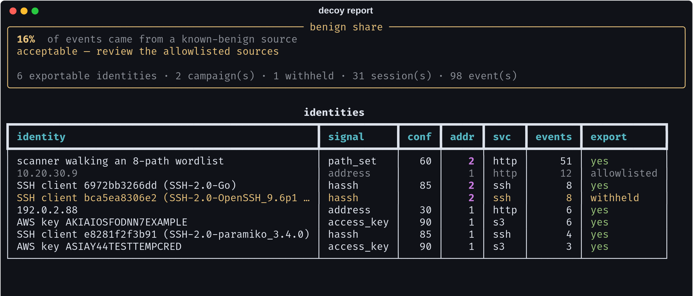
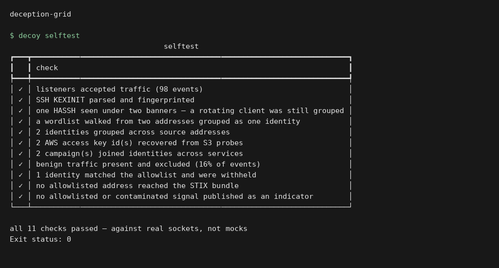
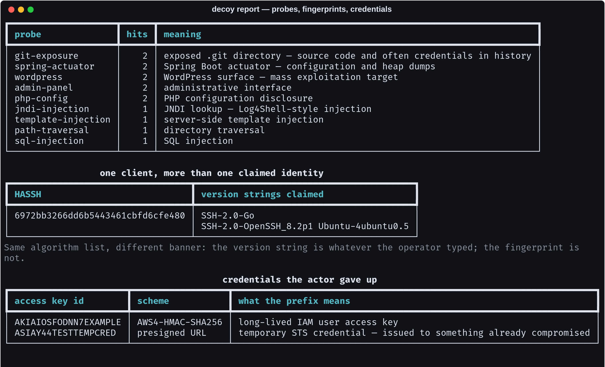
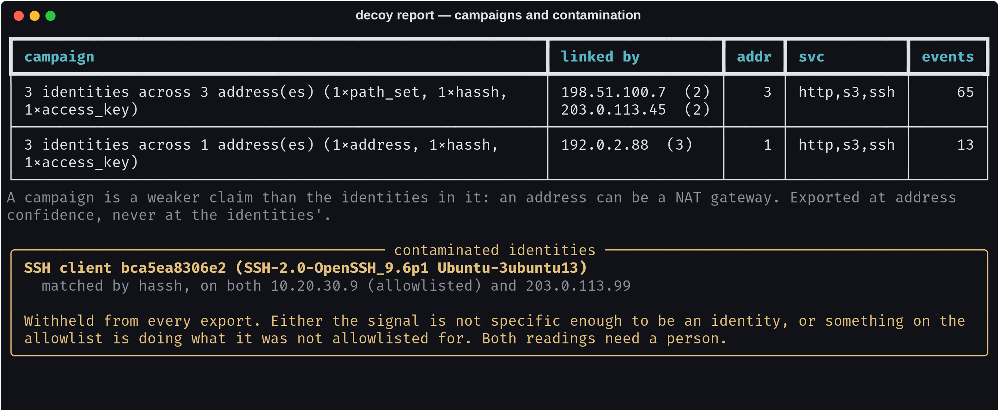
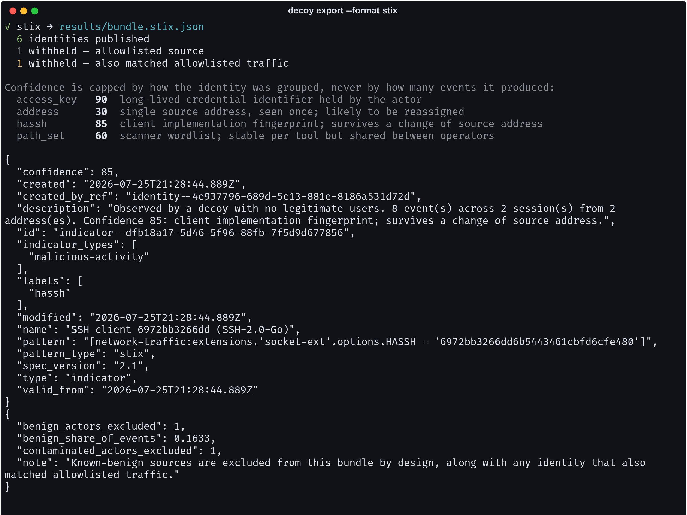
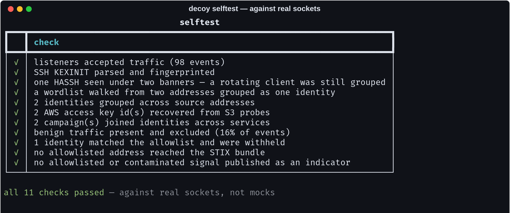

# deception-grid

**Three low-interaction decoys — SSH, HTTP, S3 — that answer one question a honeypot usually cannot: *how many people actually touched this, and is any of it worth sending to anyone else?***

[](https://github.com/Vincent-P-essy/deception-grid/actions/workflows/ci.yml)
[](pyproject.toml)
[](LICENSE)
[](tests/)

A decoy has no users. Nothing legitimate has any reason to connect to it, so every event is by construction either an intrusion attempt or a mistake in your own estate. That is the entire value proposition: **a signal with no base rate of benign activity behind it.**

Which means the thing that kills a deception programme is not being detected by an attacker. It is *your own vulnerability scanner*. Point a nightly authenticated scan at the subnet the decoys live on and they produce a few hundred meaningless events a year, and within a month nobody reads the queue. The decoys still work perfectly and the programme is dead.

So this one leads with that number.

<p align="center"></p>

---

## Execution preview



Local execution of `decoy selftest`. The input and output shown come from the repository example or test fixtures. [Verification](docs/verification.md).

## What is in the box

```
203.0.113.45 ─┐                     ┌─ ssh   ─ version exchange, KEXINIT, HASSH, close
198.51.100.7 ─┼─→  three decoys  ───┼─ http  ─ 14 probe signatures, raw + URL-decoded
192.0.2.88   ─┤    one event log    └─ s3    ─ SigV4 / SigV2 / presigned credentials
203.0.113.99 ─┤          │
10.20.30.9 ───┘          ▼
 (allowlisted)     identities ──→ campaigns ──→ STIX 2.1 / MISP
                   what is the      who is        what may leave
                   same tool?    probably one     this machine
                                   operator?
```

| Command | What it does |
|---|---|
| `decoy run` | Starts the listeners. Nothing a client sends is ever executed, opened or written. |
| `decoy capture` | Drives the decoys over real sockets and saves the events. |
| `decoy report` | Benign share first, then identities, campaigns, probes, credentials. |
| `decoy export` | STIX 2.1 or MISP, with the allowlist withheld and the withholding counted. |
| `decoy selftest` | 11 checks against real listeners on ephemeral ports. |

```bash
pip install -e .
decoy selftest                       # prove the pipeline end to end
decoy capture -o captures/mine.jsonl # drive the decoys, save the events
decoy report captures/mine.jsonl     # read them
decoy export -f stix -o bundle.json  # publish only what should be published
```

---

## Four things this gets right that are easy to get wrong

### 1. A fingerprint beats a banner, and the disagreement between them beats both

The SSH decoy completes the version exchange, reads the client's `SSH_MSG_KEXINIT`, and closes. It never performs a key exchange and never offers authentication — everything past that point means running cryptography on attacker-supplied input, and a decoy exists on a network *you* own.

It stops there because the interesting intelligence is already in hand. A KEXINIT lists, in order, every algorithm the client will accept. That ordering is a property of the **client implementation**, not of the target, and hashing four of those lists gives a [HASSH](https://github.com/salesforce/hassh) fingerprint that survives a change of source address.

A username and password are one credential pair. A HASSH is an identity:

<p align="center"></p>

The bundled capture contains one tool connecting from two addresses under two different banners — `SSH-2.0-Go` and `SSH-2.0-OpenSSH_8.2p1 Ubuntu-4ubuntu0.5`. Identical algorithm list, so identical fingerprint, so one identity. The version string is whatever the operator typed; the fingerprint is not, and **a client claiming to be OpenSSH while offering an algorithm list no OpenSSH build has ever offered is itself the finding.**

### 2. Three decoys on one grid is not three honeypots

The report separates two claims that are usually collapsed into one:

- an **identity** — the same tool, or the same credential. Grouped on a HASSH, an AWS access key ID, or a scanner's wordlist. Exportable.
- a **campaign** — probably the same operator. Identities seen from a shared source address.

<p align="center"></p>

The larger campaign in the capture spans **three addresses and all three services**, joining a web scanner's wordlist to an SSH fingerprint to an AWS access key. None of those observations is connected to the others until an address ties two of them together — and a single-service honeypot cannot make the link at all.

But a campaign is a weaker claim than the identities in it, because an address can be a NAT gateway, a VPN exit, or a residential lease that belonged to somebody else last week. So a campaign is reported and **never exported at the confidence its identities carry**. Collapsing the two layers is how one shared egress address turns a shared feed into one enormous false positive.

### 3. Nothing is asserted with more confidence than it was observed with

| Grouped by | Confidence | Why that number |
|---|---:|---|
| AWS access key ID | 90 | A long-lived credential identifier the actor holds. |
| SSH HASSH | 85 | Client implementation fingerprint; survives a change of source address. |
| Path wordlist | 60 | Stable per tool, but shared between operators running the same scanner. |
| Source address | 30 | Seen once. Very likely to be reassigned. |

<p align="center"></p>

An indicator feed that rates everything 100 is a feed of future false positives, and the recipient cannot tell which is which. Every indicator here carries the confidence its *grouping* justifies — never the confidence its event count might suggest.

### 4. What is withheld is stated, not silent

Publishing your own vulnerability scanner as an indicator of compromise is how a sharing community stops trusting your feed. Two categories never leave:

- **Allowlisted sources.** Declared with a reason (`--benign 10.20.30.=internal vulnerability scanner subnet`), and the reason is required — a source excused without one is a source nobody can review.
- **Contaminated identities.** An identity matching allowlisted traffic *and* hostile traffic. See below; this is the case that matters.

Both are counted in `x_deception_grid` inside the bundle, because an operator who cannot see that something was withheld cannot tell a filtered feed from an empty one.

---

## Three defects this found in itself

Each of these was live, silent, and caught by running the thing rather than reading it. They are recorded here because the fix is less interesting than the reason it was needed.

### Stock OpenSSH has exactly one HASSH

The capture deliberately contains an internal scanner at `10.20.30.9` and a hostile host at `203.0.113.99` running **the same Ubuntu OpenSSH build**. They therefore share a fingerprint.

The first version grouped them into one identity, marked it hostile — because *some* of its sessions were — and exported the HASSH of stock OpenSSH as `malicious-activity`. That indicator would fire on every Ubuntu host on the internet, starting with the ones inside the estate that published it.

The rule this produced: **the allowlist is a sample of things that are definitely fine, so an identity matching any of it is not specific enough to be an identity at all.** Every identity now lands in exactly one of three dispositions — exportable, allowlisted, or contaminated — and the third is withheld and shown to a person, because there are two readings and no code can pick between them:

> Either the signal is not specific enough to be an identity, or something on the allowlist is doing what it was not allowlisted for.

### The wordlist signature was dead code

Grouping scanners by the set of paths they walk was written per-session. HTTP/1.1 with `Connection: close` sends **one request per connection**, so a session holds exactly one path and a three-path threshold could never be reached.

It never fired once. Its silent effect was that every web scanner fell back to being identified by an address it can change — 30 confidence instead of 60, and no grouping across the two addresses one sweep came from. Wordlists are now computed per address, and the paths everything requests (`/`, `/health`, `/favicon.ico`) are excluded first, because merging two actors on a shared `/` is the false positive this signal is most prone to.

### The SQL injection signature matched nothing real

`(union\s+select|'\s+or\s+'1'\s*=\s*'1)` is a correct pattern for a payload nobody sends. `' OR '1'='1` reaches a server as `%27+OR+%271%27%3D%271`, and `\s` matches neither `+` nor `%20`. The probe sailed past every rule and was logged as an ordinary query string.

Requests are now matched against the raw form **and** the decoded form, twice-decoded where that differs, because a filter upstream may already have decoded once. The same bug hid `%2e%2e%2f` traversal. And separately, `/wp-(admin|login)(/|$)` missed `/wp-login.php` — the most-requested path on the internet that is not `/`.

---

## Everything published here was executed

<p align="center"></p>

There is no sample data in this repository. `decoy capture` starts the real listeners on ephemeral ports, connects to them with real sockets, sends the bytes a real scanner sends, and reads the events back out of the log. A honeypot whose tests all mock the network has tested its own opinions about the network.

The figures below came out of that run, and CI asserts every one of them against a capture made during the run:

| | |
|---|---:|
| Events captured | **98 events** across 31 sessions |
| HTTP / SSH / S3 | 69 / 20 / 9 |
| Identities found | **8 identities** — 3 HASSH, 2 access key, 1 wordlist, 2 address |
| Grouped across more than one address | **2** |
| Campaigns linking identities | **2**, the larger spanning 3 addresses and 3 services |
| Benign share | **16%** (16 of 98 events) |
| Probe types classified | **9** of 14 signatures |
| AWS access keys recovered | **2** (`AKIA…` long-lived, `ASIA…` temporary) |
| Exported as **STIX 2.1** indicators | **6** indicators, at confidence 30 / 60 / 85 / 90 |
| Withheld | 1 allowlisted, 1 contaminated |

```bash
python scripts/reproduce.py --check   # fails if any figure above has drifted
```

---

## Running it for real

```bash
docker compose -f deploy/docker-compose.yml up -d
```

A decoy accepts hostile input by design, so it is the process on your network most likely to be talking to someone who wants it. The container is built on the assumption that the code in it will one day lose:

| Constraint | Why |
|---|---|
| `read_only: true` | A decoy has no reason to write to its own filesystem. An attacker who cannot write cannot stage. |
| `cap_drop: ALL`, nothing added back | It binds high ports as a non-root user, which needs no capability. The host maps 22/80/443. |
| `no-new-privileges:true` | No setuid binary in the image can raise privilege, whatever it is. |
| `user: 10001`, no shell, no home | If the process is taken, it is taken as somebody who cannot log in anywhere. |
| `mem_limit: 128m`, `pids_limit: 64` | The workload is a few sockets and some parsing. A process needing more has stopped doing its job. |
| `tmpfs /tmp` with `noexec,nosuid` | The one writable path in the image, and nothing there can run. |

The listeners themselves refuse three things by design. **Nothing the client sends is executed, opened or written** — the decoys answer from constants, and a honeypot that "emulates" a filesystem *is* a filesystem. **Every read is bounded and every connection is on a timer.** And **every connection is recorded before it is understood** — the `connect` event is written the moment the socket is accepted, so a client that crashes the parser still leaves evidence of having been there. Parse first and a malformed probe becomes an invisible one.

---

## Layout

```
src/decoy/
  event.py      Event, benign_reason, the append-only JSONL log
  ssh.py        RFC 4253 version exchange, binary packet, KEXINIT, HASSH
  web.py        HTTP parsing, 14 probe signatures, SigV4/SigV2/presigned credentials
  server.py     the asyncio listeners and the benign-source policy
  analyse.py    sessions → identities → campaigns, and the three dispositions
  intel.py      STIX 2.1 and MISP, with the exclusions counted
  selftest.py   drives the decoys over real sockets; the source of every figure here
  cli.py        run · capture · report · export · selftest · profiles
tests/          98 tests — parsing, real sockets, grouping, and what may leave
deploy/         hardened Dockerfile and compose constraints
scripts/        reproduce.py — regenerates every published number
results/        expected.json, and the STIX and MISP documents themselves
```

## Licence

MIT — see [LICENSE](LICENSE).

Addresses in the bundled capture come from the documentation ranges reserved by RFC 5737 (`192.0.2.0/24`, `198.51.100.0/24`, `203.0.113.0/24`). The AWS key IDs are AWS's own published examples. Nothing here refers to a real host or a real credential.
